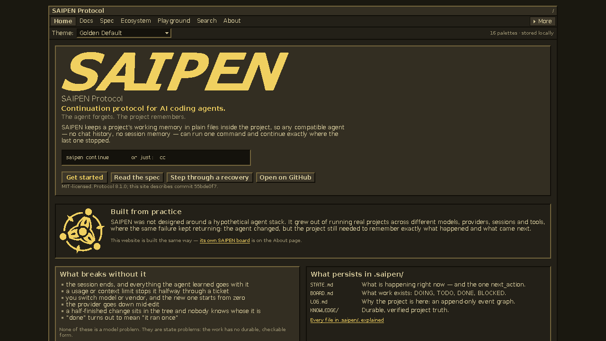
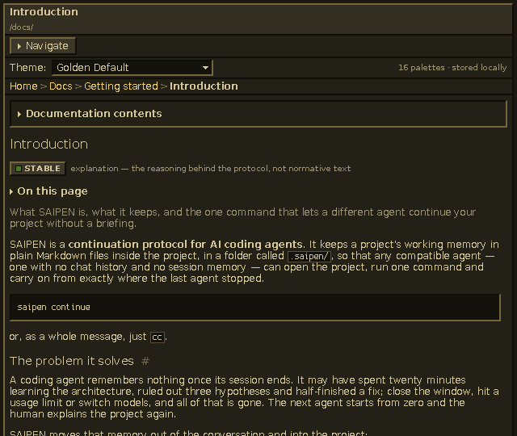

<div align="center">

# SAI WEBSITE

**Official documentation and public web surface for the SAIPEN Protocol.**

[](package.json)


[Local development](#6-local-development) · [Validation](#7-validation--quality-gates) · [Structure](#8-project-structure) · [SAIPEN Core](https://github.com/vacterro/saipen)



</div>

A pixel-exact Wintage-inspired static site for recoverable, auditable, model-independent AI-agent workflows. No backend, no accounts, no cookies, and no external runtime tracking.

## 1. What This Is

`saiwebsite` is the public web surface for the SAIPEN protocol: comprehensive documentation, an interactive specification reference generated from the canonical registry, an ecosystem catalogue, a compatibility matrix, a deterministic scenario playground, and trust pages.

The site is:
- **Static and local-first:** Zero backend, zero tracking, zero cookies, no accounts, no external runtime requests.
- **Pixel-exact retro UI:** Rendered using the **Wintage / Golden Default** design language and SAIPEN's `UI.md` iron laws — sharp pixel-grid typography with zero anti-aliasing.
- **Dogfooded:** Built and maintained using the SAIPEN protocol itself; the build inspects its own `.saipen/` board and logs to verify integrity.

---

## 2. Why SAIPEN

AI coding agents are stateless by design: when contexts compact or sessions reset, models forget prior attempts, requirements, and decisions.

SAIPEN solves this by anchoring memory in the repository itself (`.saipen/`):
- **Phased state machine:** Clear phase transitions (INIT, PLAN, SCOUT, BUILD, VERIFY, REVIEW, SHIP).
- **Verifiable tickets:** Every task carries explicit completion criteria, witness levels, and verifiable receipts.
- **Durable audit log:** Sequential event log preserving attempt history and blockers.
- **Autonomous continuation:** Any agent can run `saipen continue` and immediately resume the work without hallucinating context.

---

## 3. Website Highlights

- **Documentation Portal:** Structured guides, conceptual deep dives, protocol specifications, operational commands, and recovery runbooks.
- **16 Wintage Palettes:** Instant client-side theme switching across all 16 canonical Wintage color packs (Golden Default, Classic, Vintage Dark, Claude Code, Antigravity, K-Lite, Dracula, Nord, Solarized, OLED, and more).
- **Deterministic Playground:** Step-by-step interactive simulation of provider outages, verification failures, destructive operations, and interrupted checkpoints.
- **Specification Visualizer & Live Aliases:** Interactive state-machine exploration generated directly from the protocol schema.
- **Fast Local Search:** Keyboard-first search (Ctrl+K) indexed statically at build time.
- **Agent-First Accessibility:** Includes complete `/llms.txt` and `/llms-full.txt` endpoints for LLM consumers.

---

## 4. Visual Themes



The site supports 16 theme packs derived from Wintage, each defined by exactly 21 color tokens. Theme selection persists in localStorage with zero layout shift or white flash (FOUC).

---

## 5. Visual Law and Open Pixel Font Pipeline

Wintage and SAIPEN `UI.md` mandate that the web interface look and feel like classic Win95 software — not as a stylistic filter, but as strict pixel-level law.

### Open-License Production Font Pipeline
The production UI uses zero proprietary system fonts. All fonts are self-contained, open-source, and pre-built as WOFF2 assets:

```text
DejaVu Sans 2.37 (Regular & Bold)
    │
    ▼ 1-bit hinted rasterization at native ladder sizes (10, 11, 12, 14, 16 px)
    │
    ▼ whole-pixel glyph outlines (units-per-pixel = 128) + no-smoothing gasp table
    │
    ▼ SAI Pixel 10 / 11 / 12 / 14 / 16 (Regular, Bold via source & 1px overstrike, Italic via whole-pixel shear)
    │
    ▼ public/fonts/*.woff2  (governed by Bitstream Vera / DejaVu font licence)

Spleen 6x12 2.2.0 (BSD 2-Clause)
    │
    ▼ BDF bitmap extraction
    │
    ▼ SAI Pixel Mono 12  (public/fonts/sai-pixel-mono-12-regular.woff2)
```

- **Source SHA-256 Pinning:** `scripts/fonts/sources.json` pins exact upstream font binaries and licenses.
- **Manifest Provenance:** `public/fonts/manifest.json` tracks output byte sizes, glyph counts, ascent/descent metrics, and license notices.
- **Licence Gate:** `npm run validate:licenses` enforces that all production faces come from approved sources, third-party notices exist in `THIRD_PARTY_NOTICES.md`, and no proprietary font lineage is redistributed.

### Geometry and Bevel Rules
- **No Anti-Aliasing:** Font smoothing is disabled by design. Glyphs render as crisp whole-pixel squares.
- **Stepped Win95 Bevels:** 2px stepped bevel layers achieve tactile depth without CSS box-shadows, gradients, or blur.
- **Proof by Rendered Pixels:** Automated Playwright pixel gates screenshot every built page in Chromium and WebKit at DPR 1, asserting that every single pixel matches one of the active 21 palette tokens.

---

## 6. Local Development

### Requirements
- Node.js 22+
- npm 10+
- Python 3.10+ (for font and media generation tools)

```bash
git clone https://github.com/vacterro/saiwebsite.git
cd saiwebsite
npm install
npm run dev        # Local dev server at http://localhost:4321
npm run build      # Static production build -> dist/
npm run preview    # Preview static build at http://localhost:4321
```

Or run `start.cmd` on Windows to build and preview in your default browser.

---

## 7. Validation & Quality Gates

Every gate is verified before release. Every documented npm command corresponds to a live script in `package.json`:

```bash
npm run check               # Astro & TypeScript type check
npm run lint                # Style law lint (zero hex colors, no blur/shadow/smoothing)
npm run validate:themes     # Schema conformance across all 16 palettes
npm run validate:canonical  # Protocol snapshot integrity against upstream SHA-256
npm run validate:content    # Verifies all internal links, anchors, version alignment, and metadata
npm run validate:registry   # Page registry: stable IDs, every built route registered, honest flags
npm run site:doctor         # Content engine health: sources, locks, impact graph, generated outputs
npm run i18n:validate       # Translation rules and glyph coverage, with red controls
npm run validate:baselines  # Checks 33 visual baselines against tests/baselines/MANIFEST.json
npm run validate:licenses   # Redistribution license check for fonts, card, and notices
npm run audit:build         # HTML landmarks, headings, budgets, and theme contracts
npm run test:runtime        # Theme runtime persistence, pre-paint restore, and fallback
npm run test:shell          # Shell routes, overflow at 320/390/640/1280px, landmarks
npm run test:content        # Documentation tree, spec visualizer, playground, search
npm run test:support        # Public donation and support details verification
npm run test:i18n           # Locale variants: language, raw keys, overflow at 320/390/1280px, selector
npm run test:pixel          # Zero-tolerance 21-color pixel closure (Chromium + WebKit)
npm run test:visual         # Visual regression baselines comparison (33 baselines)
npm test                    # Full Playwright test suite
```

### Deterministic Asset Generators

```bash
npm run fonts:build         # Rebuild SAI Pixel WOFF2 faces from DejaVu & Spleen sources
npm run social:build        # Regenerate public/social/card.png and MANIFEST.json
npm run media:build         # Regenerate 1-bit brand masks and golden favicon
npm run canonical:sync      # Re-fetch canonical protocol snapshot from GitHub
npm run ecosystem:sync      # Re-fetch GitHub release metadata for ecosystem projects
```

---

## 8. Project Structure

```text
saiwebsite/
├── .github/                # GitHub Actions CI workflow and repository visual assets
│   ├── assets/             # Golden Default screenshots and theme previews
│   └── workflows/ci.yml    # Build and validation pipeline
├── public/                 # Static production assets (fonts, media, social card)
│   ├── fonts/              # SAI Pixel WOFF2 font files, manifests & licenses
│   ├── media/              # Brand marks, 1-bit masks, and golden favicon
│   └── social/             # OpenGraph preview card and provenance manifest
├── src/
│   ├── components/         # Wintage UI primitives (Window, Panel, Button, MenuBar)
│   ├── content-engine/     # Registries, models, impact graph, content blocks, i18n kernel
│   ├── locales/            # Translation units per locale (written by npm run i18n:import)
│   ├── views/              # Page views rendered once per locale
│   ├── content/docs/       # Technical documentation pages (7 sections)
│   ├── content/changelog/  # Site version release notes (0.1.0, 1.0.0, 1.1.0, 1.2.0, 1.3.0)
│   ├── data/canonical/     # Upstream SAIPEN registry & schema snapshots
│   ├── layouts/            # SiteLayout, DocsLayout, SpecLayout
│   ├── pages/              # Astro routes, spec generator, playground, search
│   ├── styles/             # Token foundations, Wintage global rules, site CSS
│   └── themes/             # 16 canonical palette JSON definitions & runtime
├── scripts/                # Verification, license validation, and asset generators
├── tests/                  # Playwright pixel, shell, content, and visual baselines
└── start.cmd               # Quick launcher for local preview
```

---

## 9. Current Publication Status & Known Limitations

- **Source Code:** Public repository on GitHub (`vacterro/saiwebsite`).
- **Version:** `v1.3.0` (Font convergence, full support/pricing, brand contrast).
- **Public Deployment:** Planned (hosting and domain attachment deferred behind future gates).

### Known Technical Limitations
- **Rendering Condition:** The strict pixel-art and non-antialiased contract applies to tested reference conditions (100% browser zoom, integer device pixel ratio). Fractional OS or browser zoom levels resample the composited page canvas.
- **Tested Engines:** Full pixel validation is tested against Chromium and WebKit.
- **Glyph Coverage:** The shipped `SAI Pixel` fonts cover Latin, Latin-1, Latin Extended-A, Cyrillic, box drawing, arrows, and UI punctuation. Glyphs outside this set fall back to generic system fonts.
- **Internationalization:** Interface and docs are currently published in English; multi-language localizations are reserved for future roadmap milestones.

---

## 10. License & Notices

- Third-party font, asset, and framework licenses are documented in [THIRD_PARTY_NOTICES.md](THIRD_PARTY_NOTICES.md).
- Upstream protocol specifications and schemas are © vacterro (MIT License).
- See [CONTRIBUTING.md](CONTRIBUTING.md) for development guidelines.

---

## 11. Links

- [SAIPEN HQ Organization](https://github.com/saipenhq/.github)
- [SAIPEN Protocol Repository](https://github.com/vacterro/saipen)
- [Wintage Repository](https://github.com/vacterro/Wintage)

<!-- VACTERRO_SUPPORT:BEGIN -->
---
<sub>If SAIPEN and its documentation are useful to you, optional support: [Buy Me a Coffee](https://buymeacoffee.com/vacuum34) · [Boosty](https://boosty.to/vacuum34/donate) · [PayPal](https://paypal.me/AlexNelin) · [other ways](https://github.com/vacterro/vacterro/blob/main/SUPPORT.md)</sub>
<!-- VACTERRO_SUPPORT:END -->
